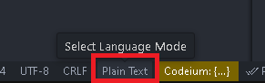
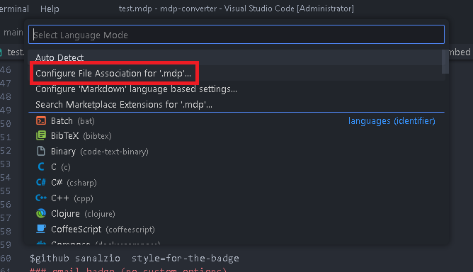
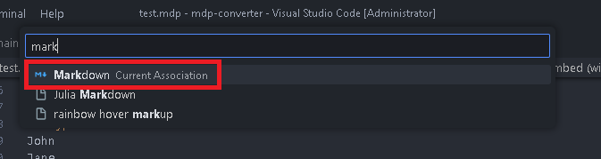

# 
Markdown Plus

- [Markdown Plus](#markdown-plus)
  - [What is the markdown plus?](#what-is-the-markdown-plus)
  - [How does it work?](#how-does-it-work)
  - [How can i use?](#how-can-i-use)
  - [How can i use mdp in vscode?](#how-can-i-use-mdp-in-vscode)
    - [step1](#step1)
    - [step2](#step2)
    - [step3](#step3)
  - [Go Documention](#go-documention)

## What is the markdown plus?
Markdown Plus makes it easier to create README.md for your projects' repositories.

## How does it work?
It converts the Markdown Plus you write on [This Site](https://sanalzio.github.io/markdown-plus/) to Markdown.

## How can i use?
Visit [This Site](https://sanalzio.github.io/markdown-plus/) and use.

## How can i use mdp in vscode?
### step1
Click on the Plain Text button in the bottom right corner.

### step2
Select the "Configure File Association for '.mdp'..." option in the opened window.

### step3
In the opened window, enter 'markdown' in the search field and select the Markdown language

## [Go Documention](https://sanalzio.github.io/markdown-plus/doc.html)